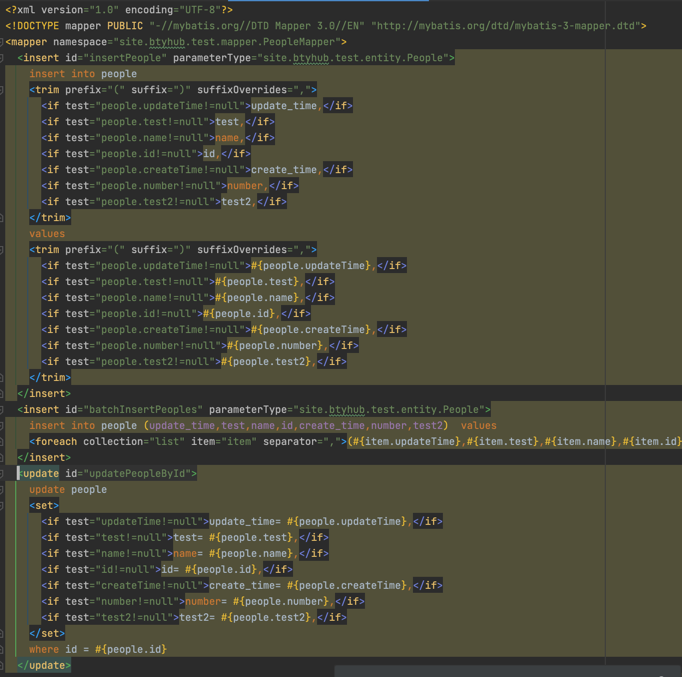

自定义Maven插件生成MyBatis实体类、Mapper、XML

Java类生成使用 javapoet

XML文件生成使用 jdom2

# 示例
## entity

## mapper

## xml



# 使用
1. 引入build
```xml
<build>
    <plugins>
        <plugin>
            <groupId>site.btyhub</groupId>
            <artifactId>codegen-maven-plugin</artifactId>
            <version>1.0-SNAPSHOT</version>
            <executions>
                <execution>
                    <goals>
                        <goal>
                            codegen
                        </goal>
                    </goals>
                </execution>
            </executions>
            <dependencies>
                <dependency>
                    <groupId>com.mysql</groupId>
                    <artifactId>mysql-connector-j</artifactId>
                    <version>${mysql.version}</version>
                </dependency>
                <dependency>
                    <groupId>org.mybatis</groupId>
                    <artifactId>mybatis</artifactId>
                    <version>${mybatis.version}</version>
                </dependency>
                <dependency>
                    <groupId>org.projectlombok</groupId>
                    <artifactId>lombok</artifactId>
                    <version>${lombok.version}</version>
                </dependency>
            </dependencies>
            <configuration>
                <absoluteFilePath>${yaml配置文件绝对路径}</absoluteFilePath>
                <skip>false</skip>
            </configuration>
        </plugin>
    </plugins>
</build>
```

2. 配置文件：参见resource目录下sample.yaml。目前仅支持yaml/yml

3. QueryExample目前日期类型转化为String.class，且支持and的where条件，条件通过${}字符串拼接，非#{}。另外，表结构只支持一个主键列。
```java
PeopleQueryExample example = PeopleQueryExample.newExample()
                .updateTimeGt("2023-06-20")
                .nameIn(Arrays.asList("name_1", "name_2"))
                .numberLte(10000);
```
