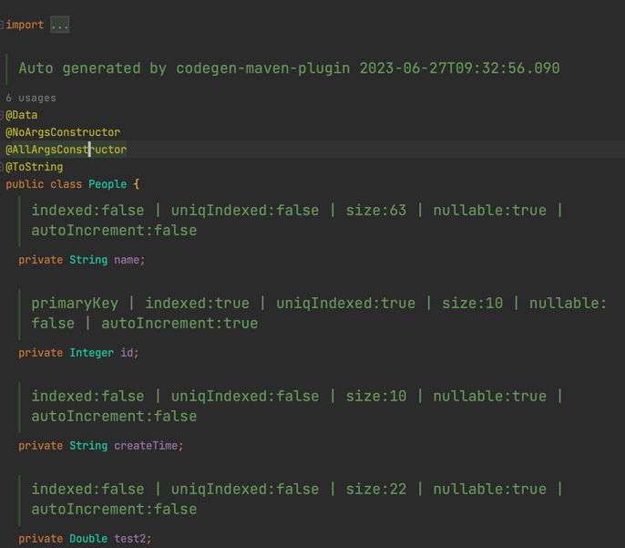

自定义Maven插件生成MyBatis实体类、Mapper、XML

Java类生成使用javapoet

# 示例
## entity

## mapper

## xml
TODO

# 使用
1. 引入build
```xml
<build>
    <plugins>
        <plugin>
            <groupId>site.btyhub</groupId>
            <artifactId>codegen-maven-plugin</artifactId>
            <version>1.0-SNAPSHOT</version>
            <configuration>
                <absoluteFilePath>${configFileAbsolutePath}</absoluteFilePath>
                <skip>false</skip>
            </configuration>
        </plugin>
    </plugins>
</build>
```

2. 配置文件：参见resource目录下sample.yaml。目前仅支持yaml/yml

TODO: XML生成
